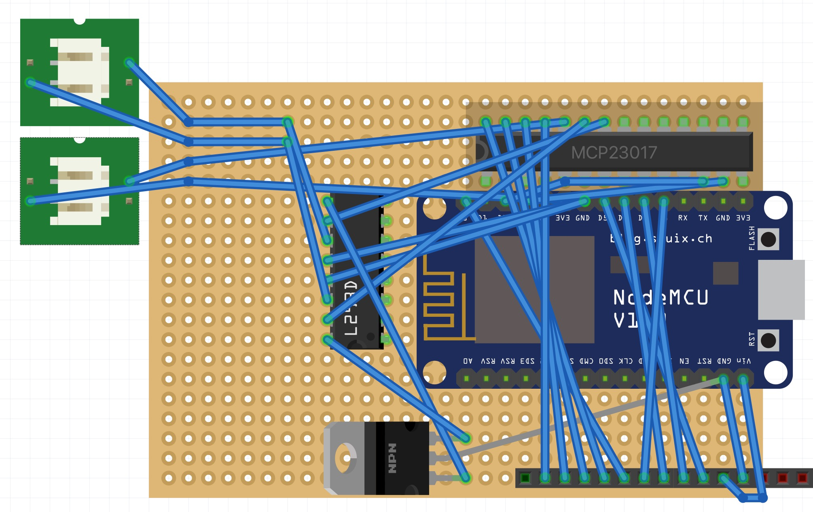

# Switch Breaker

## BOM

__Disclosure:__ All the links that start with _s.click_ are affiliated links, they help me develop the project further. Thank you!

### Switch Breaker

| SKU | Description | Qty | Sample URL |
|------|-------------|-----|-----------|
| | 12V Motor| 1 | https://aliexpress.com/item/32777233870.html |
| THSL-300-8D | 8mm Lead T8 Rod with Brass Nut | 1 | https://aliexpress.com/item/32977298147.html |

### Controller board

| SKU | Description | Qty | Sample URL |
|------|-------------|-----|-----------|
| NodeMCU  | NodeMCU ESP8266 V2 or V3 Development Board | 1 | https://aliexpress.com/item/32264218680.html
| MCP23017 | GPIO Expander | 1 | https://s.click.aliexpress.com/e/_9J0zGB |
| L293D    | 12V Motor Driver | 1 | https://s.click.aliexpress.com/e/_At8ePZ |
| L7805CV  | 12v to 5v Regulator | 1 | https://s.click.aliexpress.com/e/_AKwbDD |
|          | Heatsink for L7805CV | 1 | https://s.click.aliexpress.com/e/_Ag238R |
| DIP16    | DIP16 Socket for L293D | 1 | https://s.click.aliexpress.com/e/_9xRmen
| DIP28-narrow | DIP28 Narrow Socket for MCP23017 | 1 | https://s.click.aliexpress.com/e/_9xRmen
|          | PCB Mount DC Power Jack | 1 | https://s.click.aliexpress.com/e/_AAFHht
|          | 12v 1A+ Power Supply | 1 | https://s.click.aliexpress.com/e/_99O4l9 |
|          | 10k Resistor | 1 | https://s.click.aliexpress.com/e/_A0ad3H |
|          | 12+ Pins Female Header | 1 |

### I/O Board

| SKU | Description | Qty | Sample URL |
|------|-------------|-----|-----------|
| SSD1331 | 0.96" 96x64 SPI Full Color OLED Display | 1 | https://aliexpress.com/item/32958447200.html |
| KY-040  | Rotary Encoder with PCB | 1 | https://aliexpress.com/item/1005001621899401.html |
|         | Push Button | 1 | https://aliexpress.com/item/4000864332254.html |
|         | 12+ Pins Ribbon Cable | 1 | https://aliexpress.com/item/1005002281766539.html
|         | 12+ Pins Male Pin Headers | 1 | |

## Connections

### From I/O Board Cable

_Right to left on the diagram above_

| Pin | Description   | Target   | Target Pin |
|-----|---------------|----------|------------|
| 1   | Ground              | NodeMCU  | GND  |
| 2   | 3.3/5V              | NodeMCU  | Vin  |
| 3   | OLED SCK            | NodeMCU  | D5   |
| 4   | OLED SDA            | NodeMCU  | D7   |
| 5   | OLED RST            | NodeMCU  | D6   |
| 6   | OLED DC             | NodeMCU  | D8   |
| 7   | OLED CS             | NodeMCU  | D0   |
| 8   | Rotary SW (Switch)  | mcp23017 | GPA7 |
| 9   | Rotary DT (Data)    | mcp23017 | GPA6 |
| 10  | Rotary CLK (Clock)  | mcp23017 | GPA5 |
| 11  | Push Button         | mcp23017 | GPA4 |

### From NodeMCU

| Pin | Description   | Source   | Source Pin |
|-----|---------------|----------|------------|
| Vin | 5V or 3.3V Input | L7805CV  | 5V       |
|     |                  | IO Cable | 2        |
| GND | Ground           | L7805CV  | GND      |
|     |                  | IO Cable | 1        |
| D0  | OLED DC          | IO Cable | 7        |
| D2  | I2C SCL (Clock)  | mcp23017 | SCL      |
| D3  | I2C SDA (Data)   | mcp23017 | SDA      |
| D5  | OLED DC          | IO Cable | 3        |
| D6  | OLED RST         | IO Cable | 5        |
| D7  | OLED SDA         | IO Cable | 4        |
| D8  | OLED DC          | IO Cable | 6        |

## From mcp23017

